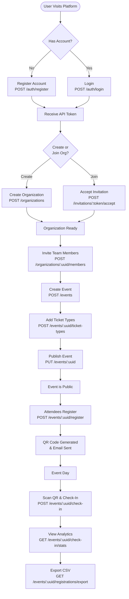
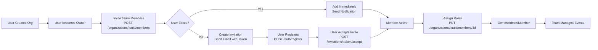
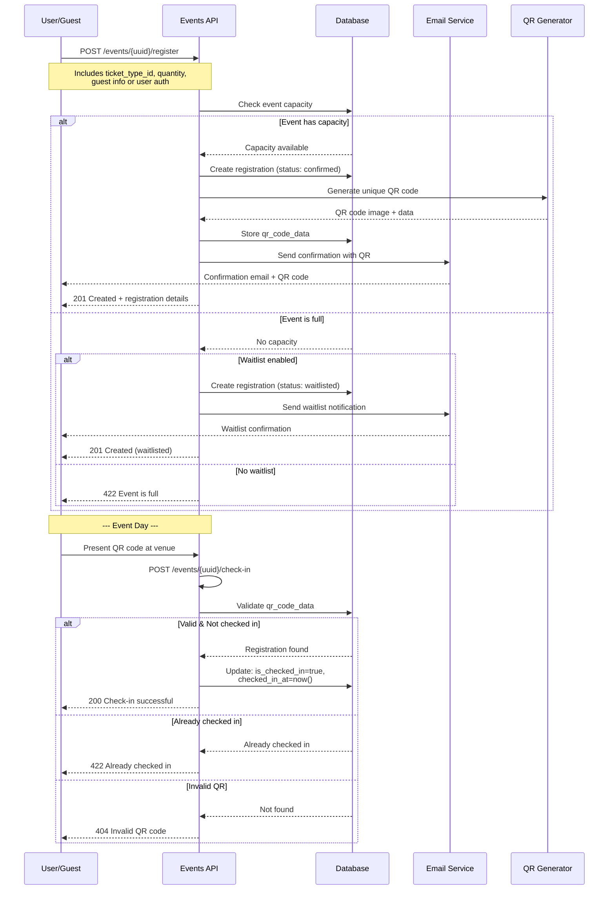
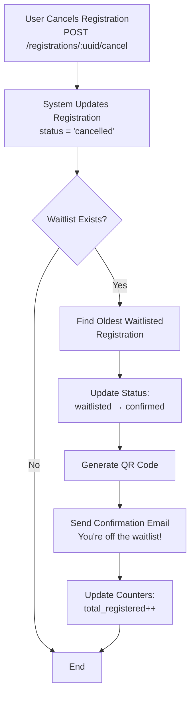
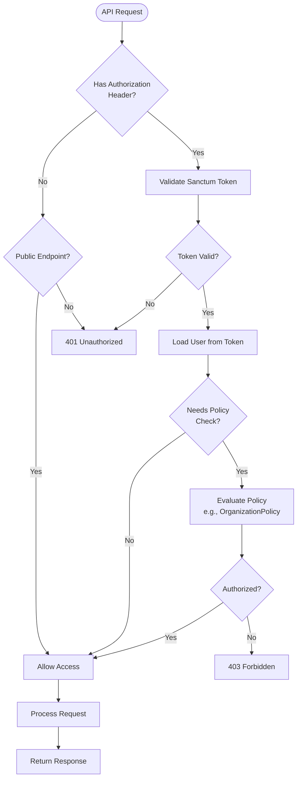

# Events API - Open Source Event Management Platform


<p align="center">
  
  
  
  
</p>

## 📖 About Events

**Events** is an open-source, headless event management API built with Laravel, inspired by [Luma](https://lu.ma). It provides a complete backend solution for creating, managing, and hosting events with features like multi-tenant organizations, ticket management, QR code check-ins, and comprehensive analytics.

Perfect for developers building event platforms, community management tools, conference systems, or ticketing applications who need a robust, well-documented API without the frontend constraints.

### 🎯 Key Features

- **🏢 Multi-Tenant Organizations** - Create organizations with team-based access control (Owner, Admin, Member roles)
- **🎫 Event Management** - Public/private events with custom branding, capacity limits, and waitlist support
- **🎟️ Flexible Ticketing** - Multiple ticket types per event with individual pricing and availability windows
- **📱 QR Code Check-Ins** - Automatic QR code generation and real-time attendee check-in tracking
- **👥 Guest & User Registrations** - Support both authenticated users and guest registrations
- **📧 Invitation System** - Email-based invitations for organization members and private events
- **📊 Analytics & Reporting** - Check-in statistics, attendance tracking, and CSV exports
- **🔒 Secure Authentication** - Laravel Sanctum token-based authentication
- **📚 Complete API Documentation** - Auto-generated Swagger/OpenAPI documentation
- **🧪 Comprehensive Testing** - 82+ feature and unit tests

---

## 🛠️ Tech Stack

- **[Laravel 13.23.0](https://laravel.com)** - Modern PHP framework
- **[Laravel Sanctum](https://laravel.com/docs/sanctum)** - API authentication
- **[L5-Swagger](https://github.com/DarkaOnLine/L5-Swagger)** - OpenAPI/Swagger documentation
- **[SimpleSoftwareIO QR Code](https://github.com/SimpleSoftwareIO/simple-qrcode)** - QR code generation
- **MySQL** - Primary database
- **PHPUnit** - Testing framework

---

## 🚀 Installation

### Prerequisites

- PHP 8.2 or higher
- Composer
- MySQL 8.0 or higher
- Node.js & NPM (for frontend integration)

### Setup Steps

1. **Clone the repository**
   ```bash
   git clone https://github.com/maakwizardry/events.git
   cd events
   ```

2. **Install dependencies**
   ```bash
   composer install
   ```

3. **Configure environment**
   ```bash
   cp .env.example .env
   php artisan key:generate
   ```

4. **Update `.env` with your database credentials**
   ```env
   DB_CONNECTION=mysql
   DB_HOST=127.0.0.1
   DB_PORT=3306
   DB_DATABASE=events
   DB_USERNAME=your_username
   DB_PASSWORD=your_password

   MAIL_MAILER=smtp
   MAIL_FROM_ADDRESS=noreply@yourdomain.com
   ```

5. **Run migrations**
   ```bash
   php artisan migrate
   ```

6. **Generate API documentation**
   ```bash
   php artisan l5-swagger:generate
   ```
   


7. **Create storage symlink**
   ```bash
   php artisan storage:link
   ```

8. **Start development server**
   ```bash
   php artisan serve
   ```

9. **Access API Documentation**
   - API Docs: `http://localhost:8000/api/documentation`
   - API Base URL: `http://localhost:8000/api/v1`

---

## 📚 API Documentation

### Base URL
```
http://localhost:8000/api/v1
```

### Authentication
All protected endpoints require a Bearer token obtained from the login endpoint:
```
Authorization: Bearer {your_token}
```

---

## 🔐 Authentication Endpoints

| Method | Endpoint | Description | Auth Required |
|--------|----------|-------------|---------------|
| `POST` | `/auth/register` | Register new user account | ❌ |
| `POST` | `/auth/login` | Login and receive API token | ❌ |
| `POST` | `/auth/logout` | Revoke current API token | ✅ |
| `GET` | `/auth/me` | Get authenticated user details | ✅ |
| `POST` | `/auth/forgot-password` | Request password reset email | ❌ |
| `POST` | `/auth/reset-password` | Reset password with token | ❌ |

### Example: User Registration
```bash
curl -X POST http://localhost:8000/api/v1/auth/register \
  -H "Content-Type: application/json" \
  -d '{
    "name": "John Doe",
    "email": "john@example.com",
    "password": "SecurePass123!",
    "password_confirmation": "SecurePass123!"
  }'
```

### Example: Login
```bash
curl -X POST http://localhost:8000/api/v1/auth/login \
  -H "Content-Type: application/json" \
  -d '{
    "email": "john@example.com",
    "password": "SecurePass123!"
  }'
```

---

## 🏢 Organization Endpoints

| Method | Endpoint | Description | Auth Required |
|--------|----------|-------------|---------------|
| `GET` | `/organizations` | List user's organizations | ✅ |
| `POST` | `/organizations` | Create new organization | ✅ |
| `GET` | `/organizations/{uuid}` | Get organization details | ✅ |
| `PUT` | `/organizations/{uuid}` | Update organization | ✅ |
| `DELETE` | `/organizations/{uuid}` | Delete organization (owner only) | ✅ |

### Example: Create Organization
```bash
curl -X POST http://localhost:8000/api/v1/organizations \
  -H "Authorization: Bearer {token}" \
  -H "Content-Type: application/json" \
  -d '{
    "name": "Tech Community SF",
    "slug": "tech-community-sf",
    "description": "San Francisco tech meetup community",
    "website_url": "https://techsf.com",
    "primary_color": "#3B82F6",
    "secondary_color": "#1E40AF"
  }'
```

---

## 👥 Team Member Management

| Method | Endpoint | Description | Auth Required |
|--------|----------|-------------|---------------|
| `GET` | `/organizations/{uuid}/members` | List organization members | ✅ |
| `POST` | `/organizations/{uuid}/members` | Add member or send invitation | ✅ |
| `PUT` | `/organizations/{uuid}/members/{id}` | Update member role | ✅ |
| `DELETE` | `/organizations/{uuid}/members/{id}` | Remove member | ✅ |

### Example: Invite Member
```bash
curl -X POST http://localhost:8000/api/v1/organizations/{uuid}/members \
  -H "Authorization: Bearer {token}" \
  -H "Content-Type: application/json" \
  -d '{
    "email": "newmember@example.com",
    "role": "admin"
  }'
```

**Response for Existing User:**
```json
{
  "message": "Member added successfully",
  "member": {
    "id": 5,
    "user": {
      "uuid": "...",
      "name": "Jane Smith",
      "email": "newmember@example.com"
    },
    "role": "admin",
    "joined_at": "2026-08-02T10:30:00Z"
  }
}
```

**Response for New User:**
```json
{
  "message": "Invitation sent successfully",
  "invitation": {
    "email": "newmember@example.com",
    "role": "admin",
    "expires_at": "2026-08-09T10:30:00Z",
    "token": "abc123xyz789..."
  }
}
```

---

## 📧 Invitation Endpoints

| Method | Endpoint | Description | Auth Required |
|--------|----------|-------------|---------------|
| `GET` | `/invitations/{token}` | Preview invitation details | ❌ |
| `POST` | `/invitations/{token}/accept` | Accept organization invitation | ✅ |
| `GET` | `/invitations/my` | List pending invitations | ✅ |

### Example: Accept Invitation
```bash
curl -X POST http://localhost:8000/api/v1/invitations/{token}/accept \
  -H "Authorization: Bearer {token}" \
  -H "Content-Type: application/json"
```

---

## 🎫 Event Management

| Method | Endpoint | Description | Auth Required |
|--------|----------|-------------|---------------|
| `GET` | `/organizations/{uuid}/events` | List organization's events | ✅ |
| `POST` | `/events` | Create new event | ✅ |
| `GET` | `/events/{uuid}` | Get event details (organizer view) | ✅ |
| `PUT` | `/events/{uuid}` | Update event | ✅ |
| `DELETE` | `/events/{uuid}` | Delete event | ✅ |
| `GET` | `/my-events` | List user's registered events | ✅ |

### Example: Create Event
```bash
curl -X POST http://localhost:8000/api/v1/events \
  -H "Authorization: Bearer {token}" \
  -H "Content-Type: application/json" \
  -d '{
    "organization_id": 1,
    "name": "Laravel Meetup 2026",
    "slug": "laravel-meetup-2026",
    "description": "Monthly Laravel developers meetup",
    "visibility": "public",
    "status": "published",
    "location_type": "hybrid",
    "venue_name": "Tech Hub SF",
    "address": "123 Market St, San Francisco, CA",
    "city": "San Francisco",
    "country": "USA",
    "latitude": 37.7749,
    "longitude": -122.4194,
    "online_meeting_url": "https://zoom.us/j/123456789",
    "starts_at": "2026-09-15T18:00:00Z",
    "ends_at": "2026-09-15T21:00:00Z",
    "timezone": "America/Los_Angeles",
    "capacity": 100,
    "enable_waitlist": true,
    "registration_opens_at": "2026-08-01T00:00:00Z",
    "registration_closes_at": "2026-09-15T12:00:00Z",
    "category": "Technology",
    "tags": ["Laravel", "PHP", "Networking"]
  }'
```

---

## 🌍 Public Event Discovery

| Method | Endpoint | Description | Auth Required |
|--------|----------|-------------|---------------|
| `GET` | `/events` | List all public events (with filters) | ❌ |
| `GET` | `/events/{uuid}` | View public event details | ❌ |
| `GET` | `/events/{uuid}/availability` | Check event capacity/availability | ❌ |

### Query Parameters for Event Listing
- `category` - Filter by event category
- `city` - Filter by city
- `country` - Filter by country
- `from_date` - Events starting after this date
- `to_date` - Events starting before this date
- `lat` & `lng` & `radius` - Find events within radius (km)
- `search` - Search in name/description
- `page` - Pagination

### Example: Discover Nearby Events
```bash
curl "http://localhost:8000/api/v1/events?lat=37.7749&lng=-122.4194&radius=50&from_date=2026-09-01&category=Technology"
```

---

## 🎟️ Ticket Type Management

| Method | Endpoint | Description | Auth Required |
|--------|----------|-------------|---------------|
| `GET` | `/events/{uuid}/ticket-types` | List event ticket types | ❌ |
| `POST` | `/events/{uuid}/ticket-types` | Create ticket type | ✅ |
| `GET` | `/events/{uuid}/ticket-types/{id}` | Get ticket type details | ❌ |
| `PUT` | `/events/{uuid}/ticket-types/{id}` | Update ticket type | ✅ |
| `DELETE` | `/events/{uuid}/ticket-types/{id}` | Delete ticket type | ✅ |

### Example: Create Ticket Types
```bash
curl -X POST http://localhost:8000/api/v1/events/{uuid}/ticket-types \
  -H "Authorization: Bearer {token}" \
  -H "Content-Type: application/json" \
  -d '{
    "name": "Early Bird",
    "description": "Limited early bird tickets",
    "price": 0,
    "quantity": 50,
    "min_per_order": 1,
    "max_per_order": 2,
    "sales_start_at": "2026-08-01T00:00:00Z",
    "sales_end_at": "2026-08-31T23:59:59Z",
    "order": 1
  }'
```

---

## 📝 Registration Endpoints

### For Authenticated Users

| Method | Endpoint | Description | Auth Required |
|--------|----------|-------------|---------------|
| `GET` | `/registrations` | List user's registrations | ✅ |
| `POST` | `/registrations/{uuid}/cancel` | Cancel registration | ✅ |

### For Public/Guest Registration

| Method | Endpoint | Description | Auth Required |
|--------|----------|-------------|---------------|
| `POST` | `/events/{uuid}/register` | Register for event (user or guest) | ❌ |
| `GET` | `/registrations/{uuid}` | View registration details | ❌ |

### Example: Guest Registration
```bash
curl -X POST http://localhost:8000/api/v1/events/{uuid}/register \
  -H "Content-Type: application/json" \
  -d '{
    "ticket_type_id": 3,
    "quantity": 2,
    "guest_name": "Alice Johnson",
    "guest_email": "alice@example.com",
    "guest_phone": "+1-555-0123",
    "custom_fields": {
      "dietary_restrictions": "Vegetarian",
      "company": "Acme Corp"
    }
  }'
```

**Response:**
```json
{
  "message": "Registration successful",
  "registration": {
    "uuid": "...",
    "event": { ... },
    "ticket_type": { ... },
    "status": "confirmed",
    "quantity": 2,
    "total_price": 0,
    "qr_code_url": "https://api.example.com/storage/qr-codes/...",
    "attendee_name": "Alice Johnson",
    "attendee_email": "alice@example.com"
  }
}
```

---

## ✅ QR Code Check-In System

| Method | Endpoint | Description | Auth Required |
|--------|----------|-------------|---------------|
| `POST` | `/events/{uuid}/check-in` | Check in attendee by QR code | ✅ |
| `GET` | `/events/{uuid}/check-in/stats` | Get check-in statistics | ✅ |
| `GET` | `/events/{uuid}/registrations` | List event registrations | ✅ |
| `GET` | `/events/{uuid}/registrations/export` | Export registrations to CSV | ✅ |

### Example: Check-In Attendee
```bash
curl -X POST http://localhost:8000/api/v1/events/{uuid}/check-in \
  -H "Authorization: Bearer {token}" \
  -H "Content-Type: application/json" \
  -d '{
    "qr_code_data": "abc123def456...",
    "location": "Main Entrance"
  }'
```

### Example: Check-In Statistics
```bash
curl http://localhost:8000/api/v1/events/{uuid}/check-in/stats \
  -H "Authorization: Bearer {token}"
```

**Response:**
```json
{
  "event": {
    "uuid": "...",
    "name": "Laravel Meetup 2026",
    "starts_at": "2026-09-15T18:00:00Z"
  },
  "summary": {
    "total_registrations": 87,
    "checked_in": 65,
    "pending_check_in": 22,
    "waitlisted": 5,
    "cancelled": 3,
    "check_in_rate": 74.71
  },
  "check_ins_by_hour": [ ... ],
  "ticket_type_breakdown": [ ... ]
}
```

### Example: Export Registrations
```bash
curl http://localhost:8000/api/v1/events/{uuid}/registrations/export \
  -H "Authorization: Bearer {token}" \
  -o registrations.csv
```

---

## 🔄 API Flow Diagrams

### 1. Complete User Journey



### 2. Organization & Team Management Flow



### 3. Event Registration & Check-In Flow



### 4. Waitlist Promotion Flow



### 5. Authentication & Authorization Flow



---

## 🎭 Use Cases

### 1. Community Meetup Platform
```
1. Create organization "Tech Community SF"
2. Invite co-organizers as admins
3. Create monthly events with free tickets
4. Enable guest registration (no login required)
5. Use QR check-in at venue entrance
6. Export attendee lists for follow-up emails
```

### 2. Conference Management
```
1. Create organization "DevConf 2026"
2. Create multi-day event with multiple sessions
3. Create ticket types: Early Bird, Regular, VIP
4. Set capacity limits per ticket type
5. Enable waitlist for popular sessions
6. Track check-ins per session location
7. Generate analytics for sponsors
```

### 3. Private Corporate Events
```
1. Create organization "Acme Corp Events"
2. Create private event (visibility: private)
3. Send email invitations to employees
4. Require authentication to register
5. Use custom fields for dietary preferences
6. Export data for catering planning
```

---

## 🧪 Testing

Run the comprehensive test suite:

```bash
# Run all tests
php artisan test

# Run with coverage
php artisan test --coverage

# Run specific test suite
php artisan test --testsuite=Feature

# Run specific test file
php artisan test tests/Feature/AuthTest.php
```

**Current Test Coverage:** 82+ tests across:
- Authentication & Authorization
- Organization Management
- Event CRUD Operations
- Registration Flow
- Check-In System
- Invitation System
- Capacity & Waitlist Logic

---

## 🔒 Security Features

- **Sanctum Token Authentication** - Secure API access with revocable tokens
- **Policy-Based Authorization** - Fine-grained access control for resources
- **Rate Limiting** - Prevent abuse with configurable rate limits
- **Email Verification** - Verify user email addresses
- **Password Reset Flow** - Secure password recovery
- **Input Validation** - All requests validated with Form Requests
- **SQL Injection Protection** - Eloquent ORM with parameterized queries
- **XSS Protection** - Output sanitization
- **CORS Configuration** - Controlled cross-origin access

---

## 📊 Database Schema Overview

```
users
  ├─ organizations (via organization_members)
  └─ registrations

organizations
  ├─ organization_members
  ├─ events
  └─ organization_invitations

events
  ├─ ticket_types
  ├─ registrations
  └─ event_invites

registrations
  ├─ user (nullable for guest registrations)
  ├─ event
  └─ ticket_type
```

---

## 🌐 API Versioning

The API uses URL-based versioning:
- **Current Version:** `v1.1.0`
- **Base Path:** `/api/v1`
- **Breaking Changes:** Will increment major version (v2, v3, etc.)

---

## 📦 Deployment

### Environment Variables

```env
APP_NAME="Events API"
APP_ENV=production
APP_DEBUG=false
APP_URL=https://api.yourdomain.com

DB_CONNECTION=mysql
DB_HOST=your-db-host
DB_DATABASE=events_production

SANCTUM_STATEFUL_DOMAINS=yourdomain.com
SESSION_DOMAIN=.yourdomain.com

MAIL_MAILER=smtp
MAIL_HOST=your-smtp-host
MAIL_PORT=587
MAIL_USERNAME=your-smtp-username
MAIL_PASSWORD=your-smtp-password
MAIL_FROM_ADDRESS=noreply@yourdomain.com

QUEUE_CONNECTION=redis
REDIS_HOST=your-redis-host
```

### Optimization Commands

```bash
php artisan config:cache
php artisan route:cache
php artisan view:cache
php artisan event:cache
```

---

## 🤝 Contributing

Contributions are welcome! Please follow these guidelines:

1. Fork the repository
2. Create a feature branch (`git checkout -b feature/amazing-feature`)
3. Write tests for new functionality
4. Ensure all tests pass (`php artisan test`)
5. Commit with descriptive messages
6. Push to your fork (`git push origin feature/amazing-feature`)
7. Open a Pull Request

### Code Style
- Follow PSR-12 coding standards
- Run `composer format` before committing
- Add PHPDoc blocks for all methods
- Write meaningful variable names

---

## 📝 License

This project is open-sourced software licensed under the **MIT License**.

```
MIT License

Copyright (c) 2026 Maak

Permission is hereby granted, free of charge, to any person obtaining a copy
of this software and associated documentation files (the "Software"), to deal
in the Software without restriction, including without limitation the rights
to use, copy, modify, merge, publish, distribute, sublicense, and/or sell
copies of the Software, and to permit persons to whom the Software is
furnished to do so, subject to the following conditions:

The above copyright notice and this permission notice shall be included in all
copies or substantial portions of the Software.

THE SOFTWARE IS PROVIDED "AS IS", WITHOUT WARRANTY OF ANY KIND, EXPRESS OR
IMPLIED, INCLUDING BUT NOT LIMITED TO THE WARRANTIES OF MERCHANTABILITY,
FITNESS FOR A PARTICULAR PURPOSE AND NONINFRINGEMENT. IN NO EVENT SHALL THE
AUTHORS OR COPYRIGHT HOLDERS BE LIABLE FOR ANY CLAIM, DAMAGES OR OTHER
LIABILITY, WHETHER IN AN ACTION OF CONTRACT, TORT OR OTHERWISE, ARISING FROM,
OUT OF OR IN CONNECTION WITH THE SOFTWARE OR THE USE OR OTHER DEALINGS IN THE
SOFTWARE.
```

---

## 🙏 Acknowledgments

- Inspired by [Luma](https://lu.ma) - The event platform that makes hosting easy
- Built with [Laravel](https://laravel.com) - The PHP framework for web artisans
- Documentation powered by [L5-Swagger](https://github.com/DarkaOnLine/L5-Swagger)

---

## 📧 Support & Contact

- **Issues:** [GitHub Issues](https://github.com/maakwizardry/events/issues)
- **Email:** support@maak.com
- **Documentation:** http://localhost:8000/api/documentation (when running locally)

---

<p align="center">
  Made with ❤️ by <a href="https://github.com/maakwizardry">Maak</a>
</p>

<p align="center">
  <a href="https://github.com/maakwizardry/events/stargazers">⭐ Star us on GitHub</a>
</p>
